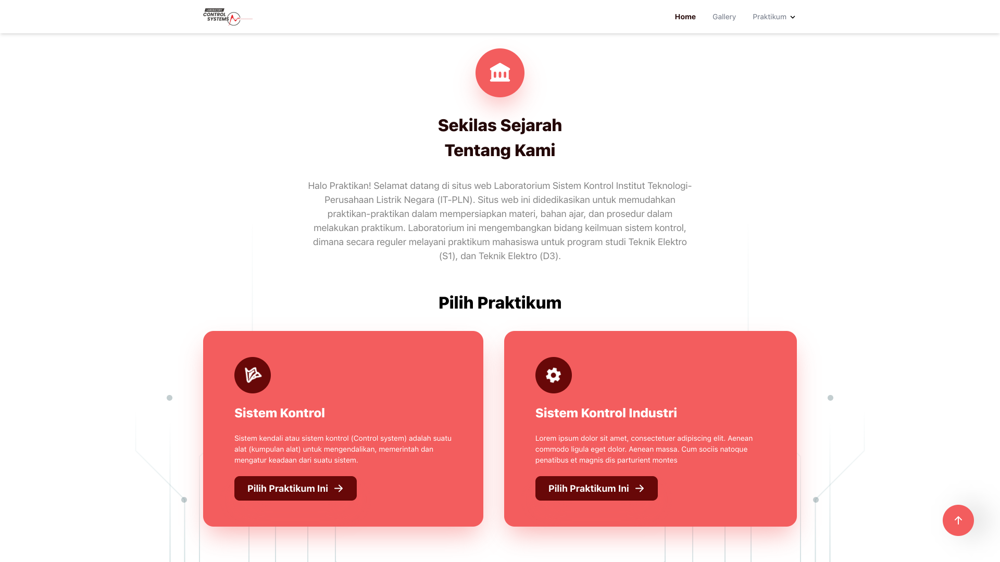

# Laboratorium Sistem Kontrol ITPLN

[https://siskon-rev.vercel.app/](https://siskon-rev.vercel.app/)

## Preview

[](https://siskon-rev.vercel.app/)

## Stack

- [Next.js](https://nextjs.org/) - A React framework with hybrid static & server rendering, and route pre-fetching, etc.
- [Tailwindcss](https://tailwindcss.com/) - A utility-first CSS framework packed with classes that can be composed to build any design, directly in your markup.
- [Framer Motion (Soon)](https://www.framer.com/motion/) - An animation library for React

## Project structure

```
$PROJECT_ROOT
│   # Page files
├── pages
│   # Next component files
├── components
│   # Static files for images
└── public
```
